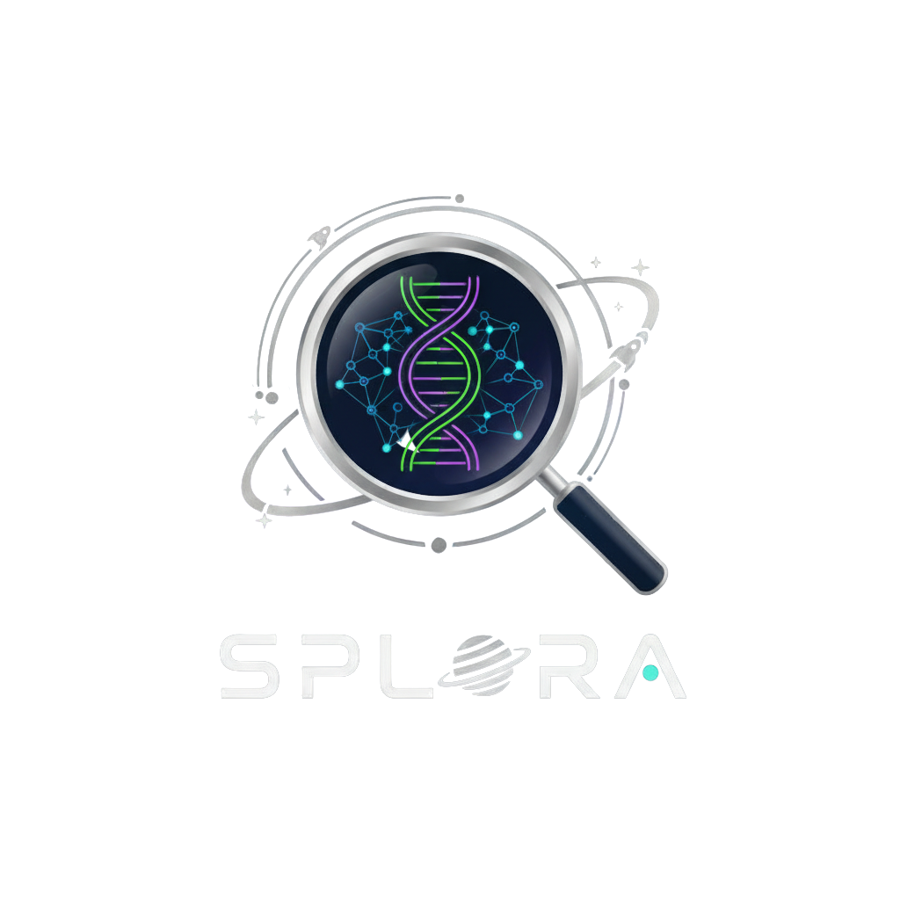

Of course! A professional `README.md` is essential for any serious project. It's your project's front door.

Here is a comprehensive, professional, and well-structured `README.md` file in English. Just copy the entire content below and paste it into the `README.md` file in the root directory of your project on GitHub.

---

# 🚀 Splora Search - An AI-Powered Search Engine for NASA's Bioscience Publications



**Splora Search is an AI-powered search and summarization engine developed for the [NASA International Space Apps Challenge 2025](https://www.spaceappschallenge.org/). This project tackles the "Enable a New Era of Human Space Exploration" challenge by making 608 NASA bioscience publications searchable, explorable, and understandable.**

[](https://www.spaceappschallenge.org/)
[](https://www.python.org/)
[](https://flask.palletsprojects.com/)
[](https://cohere.com/)

---

### ✨ Key Features

-   **🧠 Intelligent Semantic Search:** Understands the *meaning* behind your search query, not just keywords, delivering highly relevant results.
-   **⚖️ Advanced Hybrid Ranking System:** Combines the power of semantic search, keyword relevance (TF-IDF), and page authority (PageRank) to surface the best possible results.
-   **✍️ Instant AI-Powered Summarization:** With a single click, get a concise and accurate summary of any scientific article using the Cohere API.
-   **⚙️ End-to-End Search Infrastructure:** A complete system that mimics real-world search engines, featuring a crawler, indexer, and a serving API.
-   **🚀 Clean & Responsive UI:** A user-friendly front-end that allows users to search, browse results, and summarize articles smoothly.

---

### 🛠️ Tech Stack

-   **Backend:** Python, Flask
-   **AI & Machine Learning:**
    -   **Semantic Search:** `sentence-transformers`
    -   **Summarization:** `cohere`
    -   **Natural Language Processing (NLP):** `NLTK`
    -   **Relevance Scoring:** `scikit-learn (TF-IDF)`
-   **Frontend:** HTML, CSS, JavaScript
-   **Other Libraries:** Pandas, NumPy, BeautifulSoup

---

### 🏛️ Project Architecture

The project is modularly designed to separate concerns, making it clean and maintainable.

```
splora-search-main/
│
├── client/         # Frontend application (HTML, CSS, JS)
├── search/         # Core crawling, indexing, and PageRank logic
│   ├── indexing/
│   └── serving/
├── server/         # The backend Flask API and processed data
└── summarise/      # Standalone summarization module
```

---

### 🔬 How It Works: A Four-Stage Pipeline

Splora Search employs a sophisticated pipeline to ensure high-quality and relevant results.

#### Stage 1: Crawling & Indexing (The Prep Work)

-   **Script:** `search/complete_examples/advanced_pagerank.py`
-   **Process:**
    1.  **Read Sources:** The list of 608 publications is read from `SB_publication_PMC.csv`.
    2.  **Parallel Crawling:** A multi-threaded crawler visits each URL, downloads the page content, and extracts text and links using `BeautifulSoup`.
    3.  **Indexing:** The text is processed (cleaned, tokenized, stopwords removed) to build an **Inverted Index** and a link graph for the **PageRank** algorithm.
    4.  **Outputs:** The processed data is saved into two key files: `advanced_pagerank.csv` (page info and PageRank scores) and `advanced_pagerank_inverted_index.csv` (the inverted index).

#### Stage 2: Generating Semantic Embeddings (The AI Prep)

-   **Script:** `generate_embeddings.py`
-   **Process:**
    1.  The article data is loaded from `advanced_pagerank.csv`.
    2.  Using the `all-MiniLM-L6-v2` model, the title and description of each article are converted into a **numerical vector (Embedding)** that represents its meaning.
    3.  **Output:** These embeddings are saved to `server/document_embeddings.pkl` for fast, real-time semantic search.

#### Stage 3: The Search & Ranking Engine (The Core Logic)

-   **Script:** `server/google_search_api.py`
-   **Process (when a user searches):**
    1.  **Semantic Filtering:** The user's query is converted into an embedding and compared against all article embeddings. The top 100 most **semantically similar** documents are selected as candidates.
    2.  **TF-IDF Scoring:** For this candidate set, a relevance score is calculated based on **exact keyword matches**.
    3.  **Final Weighted Ranking:** The three scores are combined into a final, robust score:
        `Final Score = (70% * Semantic Score) + (20% * TF-IDF Score) + (10% * PageRank Score)`
        This formula ensures that the top results are not only similar in meaning but are also highly relevant and authoritative.

#### Stage 4: On-Demand AI Summarization

-   **Script:** `summarise/summarise_using cohere api.py`
-   **Process:**
    1.  When a user clicks the "Summarize" button, the client sends a request to the server.
    2.  The server invokes the summarization script, which crawls the article URL, extracts its clean text, and sends it to the **Cohere API**.
    3.  Cohere generates a high-quality summary, which is sent back to the user and displayed on the page.

---

### 🚀 Getting Started: How to Run Locally

Follow these steps to set up and run the project on your local machine.

**1. Prerequisites:**
-   [Git](https://git-scm.com/)
-   [Python 3.11+](https://www.python.org/downloads/)

**2. Clone the Repository:**
```bash
git clone https://github.com/YourUsername/splora-search-main.git
cd splora-search-main
```

**3. Create and Activate a Virtual Environment:**
```bash
# For Windows
python -m venv venv
venv\Scripts\activate

# For macOS/Linux
python3 -m venv venv
source venv/bin/activate
```

**4. Install Dependencies:**
```bash
pip install -r requirements.txt
```

**5. Set Up Your Cohere API Key:**
-   Get a free API key from the [Cohere Dashboard](https://dashboard.cohere.com/).
-   Open the file `server/google_search_api.py`.
-   Find the line `COHERE_API_KEY = "YOUR_API_KEY_HERE"` and replace `"YOUR_API_KEY_HERE"` with your actual key.
-   Do the same for the file `summarise/summarise_using cohere api.py`.
    > **Note for production:** For better security, it is recommended to load secrets from environment variables instead of hardcoding them.

**6. Prepare the Search Data (One-Time Step):**
-   **Note:** The pre-processed data is already included in this repository for convenience. However, if you wish to regenerate it from scratch:
```bash
# 1. Run the crawler and indexer (this may take a while)
python search/complete_examples/advanced_pagerank.py

# 2. Generate the semantic embeddings
python generate_embeddings.py
```

**7. Run the Server:**
```bash
# Use gunicorn, the recommended production server
gunicorn --bind 127.0.0.1:8080 "server.google_search_api:app"

# Alternatively, use waitress (a good option for Windows)
waitress-serve --host 127.0.0.1 --port 8080 server.google_search_api:app
```

**8. Open the Application:**
-   Navigate to the `client/` directory and open the `index.html` file in your web browser. You can now start searching!

---

### 💡 Potential Future Improvements

-   **Analytical Dashboard:** Evolve the UI into a dynamic dashboard with visualizations (e.g., timelines, word clouds) to help identify trends and knowledge gaps.
-   **Knowledge Graph Implementation:** Extract scientific entities (e.g., genes, proteins, experiments) and their relationships to enable complex, graph-based queries.
-   **Database Integration:** Migrate from CSV and Pickle files to a proper database like `SQLite` or `PostgreSQL` for improved performance, scalability, and reliability.
-   **Caching Layer:** Implement a caching mechanism (e.g., using Redis) for summaries and frequent search queries to reduce API calls and speed up response times.

---

### 📄 License

This project is licensed under the MIT License. See the `LICENSE` file for more details.

---

### 🙏 Acknowledgments

-   **NASA Space Apps:** For providing this inspiring challenge and the valuable dataset.
-   **Cohere:** For their powerful and easy-to-use text summarization API.
-   **The Open-Source Community:** For the incredible libraries and tools that made this project possible.